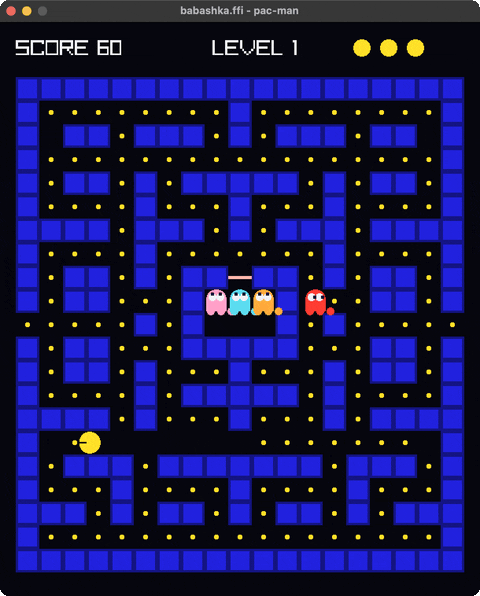
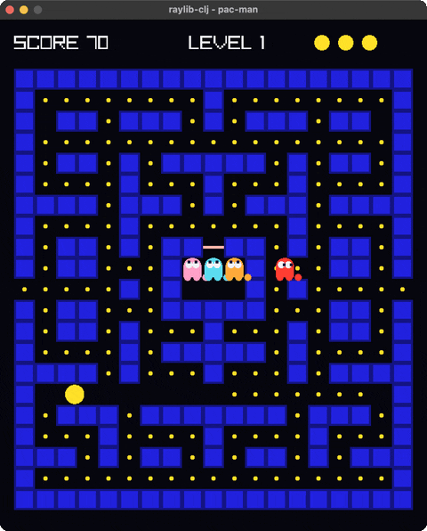
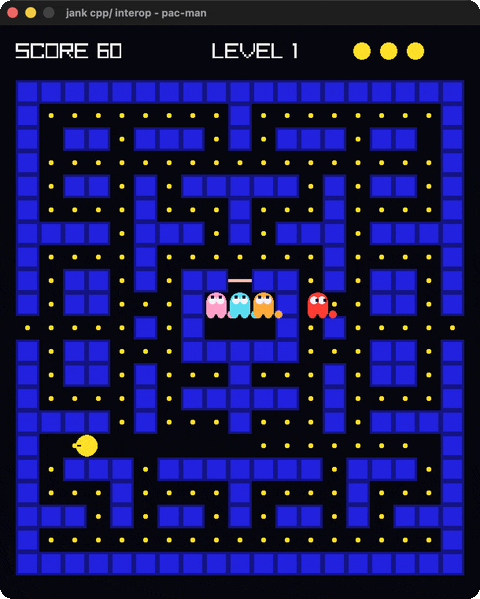
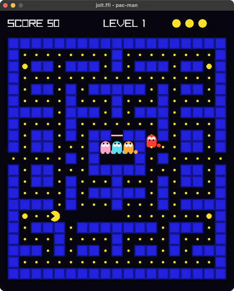

# raylib-pacman

One Pac-Man, written four times against [raylib](https://www.raylib.com), once
per Clojure-family runtime. Each directory is a standalone project you can copy
out on its own and run with `bb`, and nothing here is shared between them on
purpose.

| Example | Runtime | Binding | Build file |
|---|---|---|---|
| [`babashka-example/`](babashka-example) | babashka | `babashka.ffi` | `bb.edn` |
| [`clojure-example/`](clojure-example) | Clojure on the JVM | [raylib-clj](https://github.com/b12n-oss/raylib-clj), coffi over Panama | `deps.edn` |
| [`jank-example/`](jank-example) | [jank](https://jank-lang.org) | `cpp/` interop, `org.jank-lang.commons/raylib-sys` | `project.clj` |
| [`jolt-example/`](jolt-example) | [jolt](https://github.com/jolt-lang/jolt) | [net.b12n/raylib](https://github.com/jlt-commons/raylib-jlt), `jolt.ffi` | `deps.edn` |

| | |
|---|---|
| **babashka** <br>  | **Clojure/JVM** <br>  |
| **jank** <br>  | **jolt** <br>  |

Same maze, same ghosts, same physics, four different routes into C.

## Running one

```sh
cd babashka-example && bb pacman     # fastest to start, no build step
cd clojure-example  && bb pacman
cd jank-example     && bb pacman     # first run builds raylib natively
cd jolt-example     && bb pacman
```

Arrows or WASD steer. ENTER restarts after GAME OVER. Every example also takes
two optional arguments, which is what makes them runnable with nobody at the
keyboard:

```sh
bb pacman 10              # quit after ten seconds of game time
bb pacman 3 out.png 76    # quit after three, capture frame 76 to out.png
```

From the repository root, `bb check-all` compiles or loads all four, `bb
shot-all` runs each for three seconds and captures a PNG, and `bb doctor-all`
tells you which toolchain is missing.

## Prerequisites

Every example links against a system raylib 6.0 or newer, which none of them
bundle:

```sh
brew install raylib                       # macOS
sudo pacman -S raylib                      # Arch, and your distro's equivalent
```

Then per example: babashka needs only `bb`. The Clojure one needs a JDK 22 or
newer, because coffi sits on Panama. jank needs `jank` and a Leiningen, and jolt
needs `jolt`. None of the four needs the others.

## What is the same

The game is. All four carry the same maze, the same physics and the same
ghosts, and the interesting part is that this half of the code barely changes
between runtimes.

The world is one immutable map. `step` reads input and returns the next state,
nothing under it draws, and `draw-state!` is a pure function of the state it is
handed. Movement is worth reading before the rest: a turn is buffered on the
keypress and applied at the next tile centre where it is legal, because
deciding a direction anywhere other than a centre is what lets an entity slide
into a wall.

The ghosts keep the personalities the 1980 original gave them. Blinky heads
straight for Pac-Man's tile. Pinky aims four tiles ahead of him to cut him off.
Inky reflects Blinky's tile through a point two tiles ahead of Pac-Man, which is
why he seems to change his mind halfway down a corridor. Clyde chases until he
is within eight tiles and then breaks for his corner. They alternate scatter and
chase on a timer, and a power pellet turns all four blue at once.

## What is different

The drawing layer, and the reasons are specific enough to be worth the four
copies.

**Colour.** raylib's `Color` is a four-byte struct passed by value. raylib-clj
hands it over as a plain `{:r :g :b :a}` map. jolt and babashka both pack it
into a single integer instead, because their FFI moves scalars rather than
structs. jank could pass one too, but a jank fn may not *return* a native value,
so colours travel as packed ints and the `Color` is rebuilt inline at every draw
call, which is a position jank does allow.

**Pac-Man himself.** He is a circle with a wedge missing, and there are two ways
to get one. The Clojure and jank ports call `DrawCircleSector` and sweep from
the far lip of the mouth all the way round to the near one, so the mouth is the
part the sector never covers. babashka and jolt cannot: that call takes a
`Vector2` centre by value, which neither FFI passes, so both drop one level down
and emit the same shape as an rlgl triangle fan by hand.

**Angles.** raylib measures a sector from the positive x axis, and y grows
downward, so zero points right and the angle increases clockwise on screen. That
makes the heading a plain `atan2` in the jank and Clojure ports. The jolt
wrapper's `sector!` puts zero at the top instead, so that port converts, and
getting this wrong points Pac-Man's mouth a quarter-turn away from where he is
walking while everything still compiles and runs.

**The deadline.** All four count game time, summed from the clamped per-frame
dt, rather than wall time. jank run through Leiningen is why. `lein run`
compiles as it loads, so frame 0 pays for the entire draw path at once: six
game-seconds of play took 19.6 seconds of wall clock, of which the first twenty
frames were 6.3 of it, and every frame after that ran at a steady 60 FPS. A
wall clock charges that one-time cost against the deadline and quits before
frame 2, which looks exactly like a game that does not work.

Worth separating from jank itself, because the obvious conclusion is the wrong
one. Run the same code as the AOT binary `lein` leaves in `target/` and there is
no warm-up at all: a window in about a second, and six game-seconds in 6.4 of
wall clock. The cost belongs to the `lein run` path, not to the language.

## Adding another example

Each directory is self-contained, so a new game is a new source file next to
`pacman`, plus a task in that directory's `bb.edn`. A new *runtime* is a new
`<name>-example/` directory with its own build file, its own `bb.edn` carrying
the same `info` / `pacman` / `shot` / `check` / `doctor` tasks, and a row in the
`examples` vector at the top of the root `bb.edn`, which is what `check-all` and
friends walk.

## Guide

Longer form, in [`docs/guide/`](docs/guide):

| Page | What it covers |
|---|---|
| [the-game.md](docs/guide/the-game.md) | The half that barely changes. State, the frame step, tile-centre movement, the ghosts. |
| [crossing-to-c.md](docs/guide/crossing-to-c.md) | The comparison. How each runtime reaches raylib and what each FFI will not carry. |
| [drawing-pac-man.md](docs/guide/drawing-pac-man.md) | One shape, two implementations, and the angle convention that breaks silently. |
| [running-unattended.md](docs/guide/running-unattended.md) | Deadlines, screenshots, and why the clock is game time. |
| [babashka.md](docs/guide/babashka.md) [clojure.md](docs/guide/clojure.md) [jank.md](docs/guide/jank.md) [jolt.md](docs/guide/jolt.md) | One page per runtime. |

## Docs site

The guide pages build into a static site with the
[docs-engine](https://github.com/jlt-commons/docs-engine):

```sh
bb site:build     # generate _site/
bb site:serve     # build, then serve at localhost:3000
bb site:clean     # delete the build output
```

Nothing publishes. See `docs/site.edn` for what wiring the publish half would
involve.

## Licence

Eclipse Public License 2.0. See [LICENSE](LICENSE).

## Credits

Pac-Man is Namco's, from 1980. The babashka port began from the
[`babashka/ffi`](https://github.com/babashka/ffi/blob/main/examples/pacman.clj)
example, and the jolt port from the `pacman` example in
[jlt-commons/raylib-jlt](https://github.com/jlt-commons/raylib-jlt). The jank
project layout follows the
[raylib-sys example](https://github.com/jank-lang/commons/tree/main/raylib-sys/example)
in jank's commons repo.

The animated previews were recorded with `screen-grab` over `cgevent`, internal
b12n tools that are not public yet. Every GIF is committed, so nothing here
needs a capture toolchain to build or read.
