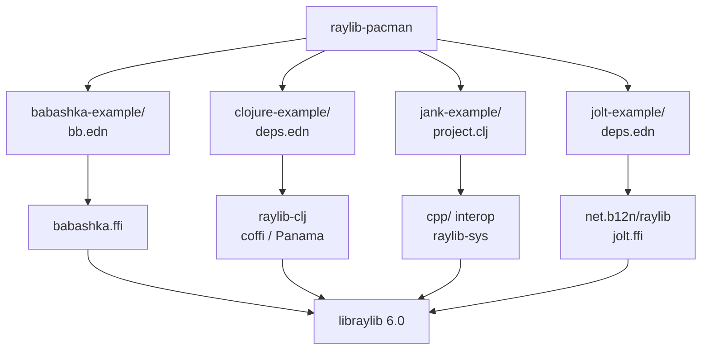
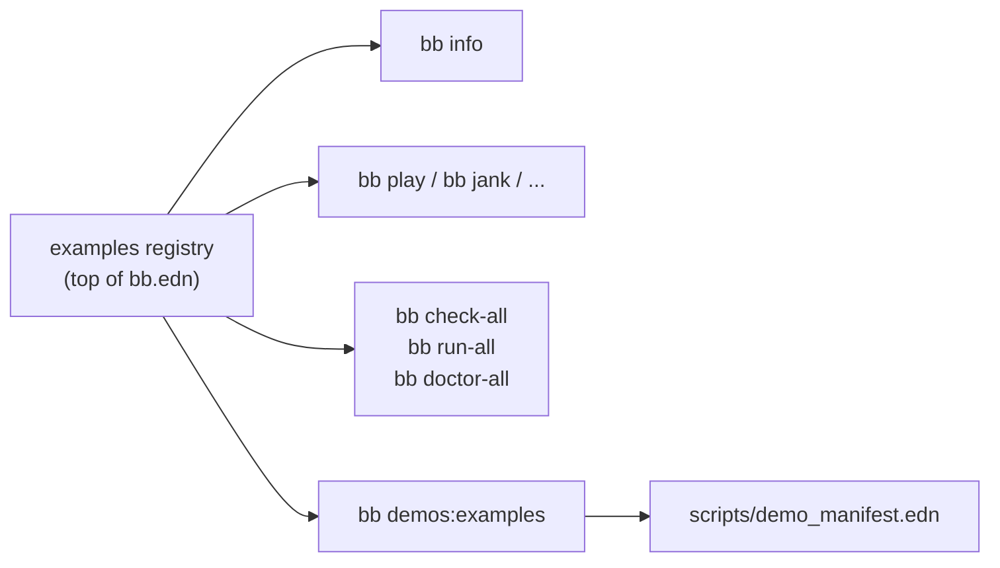
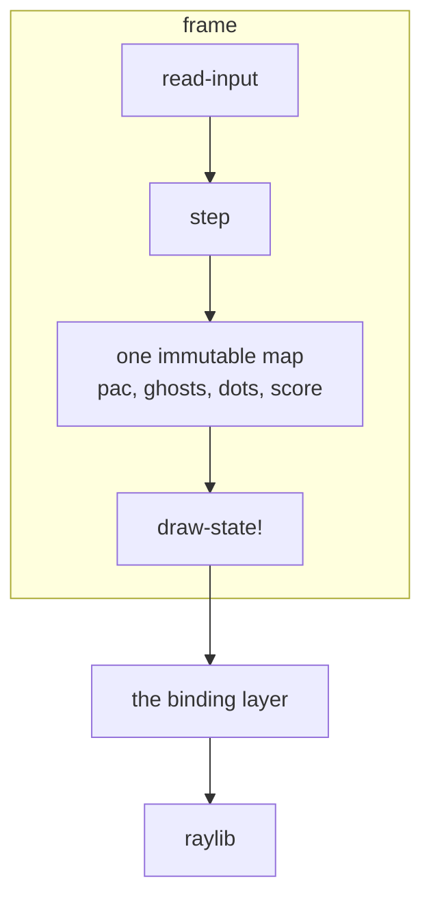

# Architecture

This repository is four separate programs that happen to be the same game. It
is deliberately not a library with four backends, and this page is about why,
and about what that shape buys.

## Four standalone projects, nothing shared

Each directory builds and runs on its own toolchain, with its own build file,
and carries a full copy of the game. Copy any one of them out of this
repository and it still works.

The duplication is the point. A shared core with four thin adapters would hide
exactly what a reader comes here for: how much of the code actually has to
change when the runtime does, and which parts do not. With four full copies you
can diff them.

## The root is a convenience, not a build system

The root `bb.edn` holds one registry entry per example and every task walks it.
Each task then shells into the example's own `bb.edn` rather than
reimplementing the launch, so the directories stay independent and there is one
definition of how each port starts.

`bb demos:examples` prints that same registry as the item list the demo
recorder consumes, which is what stops the manifest drifting from the projects
it records.

Adding a runtime means adding a directory and one registry entry. Nothing else
in the root changes.

## Inside one port

Every port has the same three layers, in the same order in the file.

- **The world** is a single immutable map. `step` takes it and returns the next
  one.
- **Nothing under `step` draws**, and `draw-state!` is a function of the map it
  is handed. That split is what let the same logic move across four runtimes
  without being rethought.
- **The binding layer** is the only part that differs, and it differs because
  each FFI carries a different amount across the boundary.

[The game](the-game.md) covers the first two layers. [Crossing to
C](crossing-to-c.md) covers the third, which is where all four diverge.

## What decides the differences

One question explains most of them: what will this FFI move across the
boundary?

| | Structs by value | What this port does with that |
|---|---|---|
| coffi / Panama | yes, as maps | `Color` is `{:r :g :b :a}`, `DrawCircleSector` called directly |
| jank `cpp/` | yes, but a fn may not RETURN one | colours travel as packed ints, rebuilt inline at each call |
| `babashka.ffi` | yes, as maps | colour packed into a uint anyway, Pac-Man hand-rolled from rlgl triangles |
| `jolt.ffi` | yes, `:by-value` plus a layout buffer | same, via the wrapper's own `sector!` |

Note the right-hand column says what each port does, not what its FFI allows.
All four can pass a struct by value, and the bottom two choose the packed int
and the triangle fan regardless, which is a smaller difference than this table
used to claim. The jank row is the only hard constraint in it.

## Documentation

`docs/guide/*.md` is the source, `docs/site.edn` configures it, and the
[docs-engine](https://github.com/jlt-commons/docs-engine) renders it into
`_site/`. `bb site:build` runs it locally; nothing publishes.

`docs/demos/` holds a still and an animated preview per port. Both are
committed, so the site builds with no capture toolchain installed.
